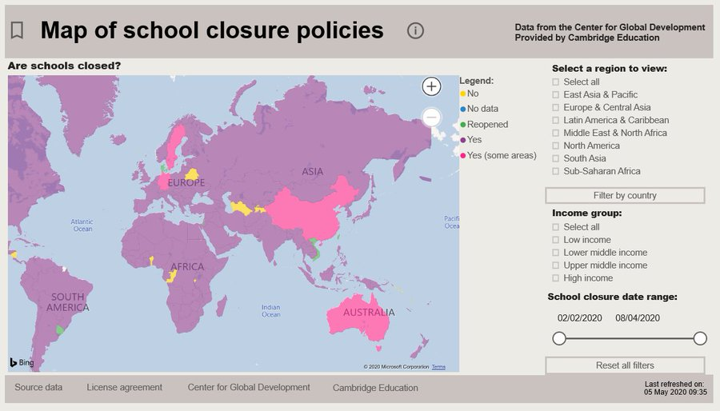

This is copied from https://www.ukfiet.org/2020/minding-the-gap-visualising-the-impact-of-covid-19/

# Minding the gap – visualising the impact of COVID-19

by Stuart Johnson on May 13, 2020 in Coronavirus, Learning  0
 
 
 
This blog was written by Stuart Johnson, senior education adviser and monitoring and evaluation specialist at Cambridge Education. Follow him on Twitter @stuartpjohnson. This blog was originally published on the Cambridge Education website.

## Stuart Johnson explains how a new data visualisation tool exposes COVID-19’s disruption to the education of children around the world.

“What strange times we’re living in!” I’ve lost count of the number of times I’ve said that phrase or it has been said to me over the past six weeks. The COVID-19 pandemic and the associated social distancing have entirely transformed our daily lives and routines. Working from home, video calls with friends and catching the daily press briefing from Downing Street are the new normal for my wife and me. For my children, the pandemic means missing their friends, exercising in front of YouTube and, of course, home schooling.

 
While the details of the upheaval to daily life in the pandemic vary from family to family and from country to country, one experience that is nearly universal around the world is the closure of schools. Before China re-opened some schools on 26 April, UNESCO was estimating that school closures were affecting more than 90% of learners worldwide – more than 1.5 billion children and young people. The world has never known this level of disruption to children’s education.

## The Center for Global Development’s global school closures database

Many organisations working in international education have stepped forward to address this unique challenge, offering resources and insights of various kinds. One such organisation is the Center for Global Development, a think tank based in Washington DC. A week after my sons’ schools in the UK were closed, I read a blog about a new database the Centre had created to capture detailed information about global school closures and the support measures countries are providing during these. Sourcing material from news articles, official social media pages and government websites, the database is continuously updated and expanded as the situation evolves.

While the database is hugely valuable and interesting, it is housed in a large, online spreadsheet which makes viewing the data challenging and, I fear, limits the use that would otherwise be made of it. When I first opened the database, I was captivated by the wealth of information, but I wanted to view the data in a more user-friendly and visually-appealing package. I saw the opportunity to create something that could support policy makers, advisers, researchers and donors in their understanding and interventions, thereby helping to lessen the impact of the disruption to education for children around the world. Our new data visualisation tool uses Microsoft Power BI software to bring the Center for Global Development’s database to life and, I hope, to new audiences.

## Cambridge Education’s web viewer for the global school closures database

The Power BI-based web viewer has eight interactive pages and is free for anyone to use and explore. The first two pages provide global maps showing country-level policies on school closure and country-level approaches to distance learning during the school closures. When I first used the database, most countries had not closed their schools. Now, as the screen shot at the top of the page shows, most of the world is coloured purple, indicating that schools are closed. Just a handful of countries have not closed their schools (yellow) or have started to re-open them (green).

The map on the second page shows the distance learning approaches that have been put in place at national level while schools are closed. It reveals how online learning resources have been provided in much of the world. The notable exception to this is in sub-Saharan Africa, where much of the map is coloured red. While some countries are distributing learning by radio and television, much of the continent is without any such distance learning provision. By showing the data in this way, we can start to see where we risk leaving the most vulnerable behind.

Other pages provide the opportunity to look at policies adopted at country level including closures and eventually re-openings, whether exams have been affected and the types of distance learning approaches that have been adopted. There is also a section which details if any social protection measures have been adopted, such as subsidised sick leave, cash transfers or food vouchers.

The final two pages display a series of metrics as interactive charts: for example, the number of countries providing different distance learning approaches by global region and by country-level income group. Here we can see that online and television are the most common approaches to distance learning in high and middle income countries, whereas radio is most common in low income countries. We also see that just 18 countries around the world are known to have put in place a plan dedicated to children and young people with special educational needs. None of these 18 countries is in the low income group.

## What are my hopes and goals for this web resource?

One of the most important roles this data can play is to draw attention to gaps in and the unequal distribution of provision. I hope that the web viewer will be used by fellow colleagues working in the international education sphere to identify patterns, trends and gaps in order to better advise, plan and make decisions. I hope too that it will be useful for policymakers and donors in order that wise decisions are taken and that resources are allocated effectively, to redress inequalities and to fill gaps in provision.

My purpose in creating this web viewer is for more people to view and use the Center for Global Development’s database, and to gain a greater, fuller and accurate understanding of the effect that the COVID-19 pandemic is having on education systems around the world and on the children and young people they are meant to serve.

My hope also is that it will be used by others not in the international education sector who wish simply to comprehend the magnitude and nature of the impact that this devastating pandemic is happening on our world and, in this way, on the lives of a whole generation of children and young people.

**Whatever your role and your interest, I invite you to explore this new tool and to reflect on the profound impact that the COVID-19 pandemic is having on the world’s children.**